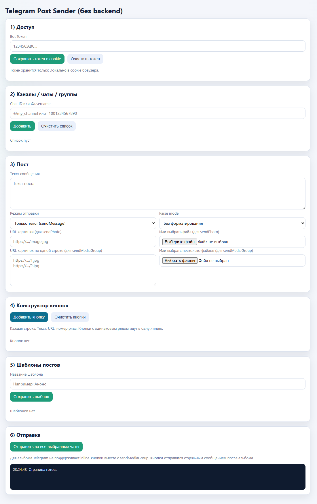

# Telegram Post Sender (No Backend)

Локальная веб-страница для отправки постов в Telegram через бота без сервера.

## Что это

Этот проект позволяет из браузера отправлять сообщения в каналы, чаты и группы Telegram через Bot API.
Всё работает на чистом frontend (`index.html`), без backend и без базы данных.

## Возможности

- Ввод токена бота на странице
- Хранение токена только в cookie браузера
- Добавление нескольких получателей (`@username` и `chat_id`)
- Выбор каналов/чатов для отправки через чекбоксы
- Подсветка выбранных каналов в списке
- Двухколоночный список каналов при количестве больше 5
- Отправка текста (`sendMessage`)
- Отправка одной картинки (`sendPhoto`):
  - по URL
  - из локального файла
- Отправка альбома (`sendMediaGroup`):
  - по URL
  - из локальных файлов
  - смешанный вариант (URL + файлы)
- Визуальный конструктор inline-кнопок
- Шаблоны постов (пресеты)
- Массовая отправка в выбранные чаты с задержкой 5–7 секунд между отправками
- Лог статуса отправки в интерфейсе

## Запуск

1. Скачайте проект.
2. Откройте `index.html` в браузере.
3. Введите токен бота и нажмите «Сохранить токен в cookie».
4. Добавьте каналы/чаты, отметьте нужные, заполните пост и нажмите отправку.

## Требования

- Современный браузер (Chrome/Edge/Firefox)
- Доступ в интернет к `https://api.telegram.org`
- Бот должен быть добавлен в канал/группу и иметь права на отправку сообщений

## Ограничения

- Inline-кнопки нельзя прикрепить напрямую к `sendMediaGroup` (ограничение Telegram API), поэтому кнопки отправляются отдельным сообщением после альбома.
- Файлы изображений не сохраняются в шаблонах (ограничение безопасности браузера).

## Безопасность

- Токен хранится локально в cookie текущего браузера.
- Не публикуйте токен и не передавайте его третьим лицам.
- Для продакшен-сценариев рекомендуется отдельный backend с безопасным хранением секретов.

## Технологии

- HTML
- CSS
- Vanilla JavaScript
- Telegram Bot API

## Авторство

- Код страницы был реализован с помощью **OpenAI Codex (GPT-5)** по моему техническому заданию.
- Владелец репозитория: [Dosash.ru](https://dosash.ru)
