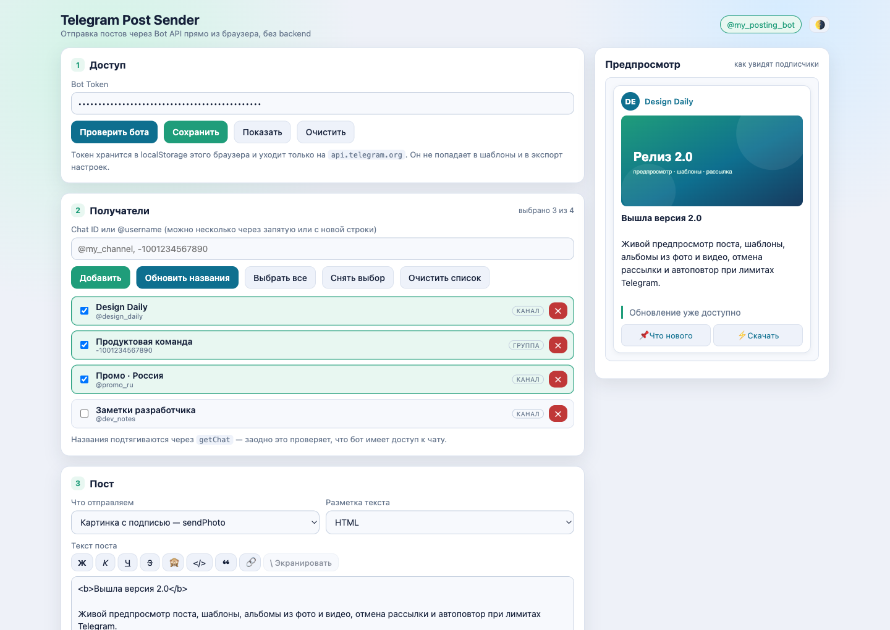

# Telegram Post Sender (No Backend)

Отправка постов в Telegram-каналы через бота — из браузера, без сервера.
Один HTML-файл: скачали, открыли, работаете.

## Содержание

- [Что это такое](#что-это-такое)
- [Быстрый старт](#быстрый-старт)
- [Как узнать идентификатор канала](#как-узнать-идентификатор-канала)
- [Картинки по ссылке](#картинки-по-ссылке)
- [Возможности](#возможности)
- [Приватность и безопасность](#приватность-и-безопасность)
- [Частые ошибки и что они значат](#частые-ошибки-и-что-они-значат)
- [Ограничения Telegram](#ограничения-telegram)
- [Поддержка](#-поддержка)

## Что это такое

Страница отправляет сообщения в каналы, группы и чаты Telegram через официальный
Bot API. Пригодится, если вы ведёте несколько каналов и хотите публиковать пост
сразу во все — с картинками, форматированием и кнопками.

Всё работает на чистом frontend: ни backend, ни базы данных, ни сборки, ни
установки. Никакой регистрации и никаких аккаунтов.

## Быстрый старт

### 1. Создайте бота

Откройте в Telegram [@BotFather](https://t.me/BotFather), отправьте `/newbot`
и придумайте имя. В ответ придёт токен вида `123456789:AAH…` — это пароль
от бота, скопируйте его.

### 2. Добавьте бота в канал администратором

В настройках канала: **Администраторы → Добавить администратора →** найдите
своего бота → оставьте право **«Публикация сообщений»**.

Без прав администратора бот писать в канал не сможет — это правило Telegram,
обойти его нельзя.

### 3. Откройте страницу

Скачайте `index.html` и откройте двойным щелчком в браузере. Запускать ничего
не нужно, интернет нужен только для связи с Telegram.

### 4. Отправьте пост

1. Вставьте токен в шаге 1 и нажмите **«Проверить бота»** — должно появиться
   имя бота.
2. В шаге 2 добавьте канал и нажмите **«Обновить названия»**.
3. В шаге 3 напишите текст, при желании добавьте картинку.
4. В шаге 6 нажмите **«Отправить в выбранные чаты»**.

Справа виден предпросмотр — пост будет выглядеть именно так.

## Как узнать идентификатор канала

| Тип чата | Что указывать | Как узнать |
| --- | --- | --- |
| Публичный канал или группа | `@имя_канала` | Это то, что стоит в ссылке `t.me/имя_канала` |
| Приватный канал | `-1001234567890` | Перешлите любое сообщение из канала боту [@getmyid_bot](https://t.me/getmyid_bot) |
| Личный чат | Числовой ID | У того же бота. Бот сможет вам писать, только если вы первым нажали «Старт» |

Кнопка «Обновить названия» подтягивает имена каналов через Telegram и заодно
проверяет, что бот действительно имеет к ним доступ.

## Картинки по ссылке

Ссылку на картинку можно просто вставить в поле — дальше её скачает сам Telegram,
нажимать ничего не нужно. Так работает по умолчанию.

### Когда нужна кнопка «Подгрузить»

Иногда Telegram не может забрать файл по ссылке: сайт закрывает доступ ботам,
отдаёт картинку слишком долго или файл больше 5 МБ — это лимит Telegram для фото
по ссылке.

Тогда нажмите **«⬇ Подгрузить»**: браузер скачает картинку сам, и она уйдёт
в Telegram уже файлом. Лимит в этом случае — 10 МБ для фото и 50 МБ для остального.
В альбоме кнопка «Подгрузить все ссылки» проходит по списку: что удалось — станет
файлами, остальное останется ссылками.

### Почему иногда не срабатывает

Браузеру разрешено показывать чужие картинки, но не читать их содержимое, если
сайт-источник этого явно не разрешил (заголовок `Access-Control-Allow-Origin`).
Это защита самого браузера, а не недоработка страницы.

Обойти запрет можно было бы только через промежуточный сервер — то есть отправляя
ваши файлы через чужие руки. Поэтому здесь такого нет: если скачать не вышло,
страница честно об этом скажет и оставит ссылку, а файл заберёт Telegram, как
и раньше. Хуже, чем было, не станет никогда.

### Скриншот из буфера

Скопировали картинку — нажмите <kbd>Ctrl</kbd>/<kbd>Cmd</kbd> + <kbd>V</kbd>
на странице, она сразу подставится в пост.

## Возможности

**Пост**

- Текст (`sendMessage`), картинка (`sendPhoto`), видео (`sendVideo`), файл (`sendDocument`)
- Альбом (`sendMediaGroup`) с миксом фото и видео, из ссылок и локальных файлов одновременно
- Разметка HTML и MarkdownV2 с панелью форматирования: жирный, курсив, подчёркнутый,
  зачёркнутый, спойлер, моноширинный, цитата, ссылка
- Живой предпросмотр поста в виде сообщения в канале
- Счётчик символов с лимитами Telegram
- Опции: без звука, запрет пересылки, отключение превью ссылок
- Картинку можно вставить ссылкой, а кнопкой «Подгрузить» — скачать её в браузер
  и отправить файлом ([подробнее](#картинки-по-ссылке))
- Файлы можно перетащить мышью или вставить из буфера обмена
  (<kbd>Ctrl</kbd>/<kbd>Cmd</kbd> + <kbd>V</kbd>)

**Получатели**

- Добавление нескольких чатов сразу — через запятую или с новой строки
- Названия каналов вместо голых `-100…` идентификаторов
- Выбор получателей чекбоксами, массовое выделение

**Кнопки**

- Визуальный конструктор inline-кнопок с настройкой числа кнопок в ряд
- Эмодзи-маркеры для визуального выделения кнопки
- Перестановка кнопок и проверка ссылок

**Рассылка**

- Отправка в выбранные чаты с настраиваемой случайной паузой
- Медиа передаётся в Telegram один раз: остальные чаты получают его по `file_id`.
  Файл с диска не перезаливается, а ссылку Telegram скачивает с сайта-источника
  однократно, а не для каждого канала
- Автоматический повтор при ошибке 429 — пауза берётся из ответа Telegram
- Отмена рассылки на середине, прогресс и итоговая сводка
- Понятная расшифровка ошибок Bot API
- Горячая клавиша <kbd>Ctrl</kbd>/<kbd>Cmd</kbd> + <kbd>Enter</kbd>

**Прочее**

- Шаблоны постов, автосохранение черновика
- Экспорт и импорт списка чатов и шаблонов в JSON
- Светлая и тёмная тема
- Встроенная справка прямо на странице

## Приватность и безопасность

Токен бота — это фактически пароль, поэтому вопрос законный. Отвечаем подробно.

### Данные никуда не уходят

**У проекта нет сервера.** Это один HTML-файл без backend и базы данных.
Вашему токену и спискам каналов физически негде храниться, кроме вашего браузера.

**Страница обращается только к `api.telegram.org`** — напрямую, ровно как это
делает ваше приложение Telegram. Ни аналитики, ни счётчиков посещений, ни внешних
шрифтов и библиотек с чужих CDN.

Единственное исключение — кнопка **«Подгрузить»**. Нажав её, вы просите браузер
скачать картинку с того адреса, который вписали сами. Запрос идёт напрямую на этот
адрес, без посредников, и только по вашему нажатию.

**Автор страницы не видит ничего** — ему просто нечего показать, никакого канала
передачи данных не существует.

### Это можно проверить самому

Не верьте на слово — проверьте:

1. Откройте страницу и нажмите <kbd>F12</kbd> → вкладка **Network**.
2. Отправьте тестовый пост.
3. В списке запросов будут только обращения к `api.telegram.org` — и к адресам
   картинок, если вы нажимали «Подгрузить».

Исходный код открыт целиком и лежит в одном файле — его можно прочитать
или дать почитать знающему человеку.

### Что и где хранится

Токен, список каналов, шаблоны и черновик лежат в `localStorage` — это
встроенное хранилище браузера на вашем компьютере. Данные привязаны к вашему
браузеру и не покидают его.

Токен передаётся только в адресе запроса к Bot API — иначе Telegram не поймёт,
от какого бота отправлять сообщение.

**Экспорт настроек не содержит токена** — файл можно спокойно переносить между
компьютерами.

### Разумные меры предосторожности

- Открывайте страницу с локального файла, а не с чужого сайта. При открытии
  с хостинга страница сама покажет предупреждение: там к токену может получить
  доступ любой посторонний скрипт.
- Не пользуйтесь ей на общем или рабочем компьютере, где к браузеру есть доступ
  у других людей.
- Чтобы стереть данные: кнопка «Очистить» рядом с токеном и «Очистить список»
  в разделе получателей. Полностью — через удаление данных сайта в настройках
  браузера.
- Если токен всё же засветился, отзовите его командой `/revoke` у @BotFather.
  Старый токен мгновенно перестанет работать.

Токен бота даёт полный контроль над ботом, но не над вашим аккаунтом Telegram:
войти под вами по нему нельзя.

## Частые ошибки и что они значат

| Ошибка | Что случилось |
| --- | --- |
| `chat not found` | Опечатка в имени канала, либо для приватного канала указан `@username` вместо числового `-100…` |
| `not enough rights` | Бот в канале есть, но без права публиковать сообщения |
| `bot was kicked` | Бота удалили из канала — добавьте заново |
| `unauthorized` | Токен неверный или отозван, получите новый у @BotFather |
| `can't parse entities` | Ошибка разметки: незакрытый тег в HTML или неэкранированный символ в MarkdownV2 |
| `Too Many Requests` | Сработал лимит Telegram. Страница подождёт и повторит сама; если часто — увеличьте паузу в шаге 6 |
| Сеть недоступна | Нет интернета либо доступ к `api.telegram.org` заблокирован — поможет VPN |

## Ограничения Telegram

Это ограничения самого Bot API, а не страницы:

- **Кнопки нельзя покрасить.** У кнопки в API есть только текст и ссылка —
  поля цвета не существует. Выделить кнопку можно эмодзи-маркером.
- **Альбом не носит кнопки.** `sendMediaGroup` не принимает разметку клавиатуры,
  поэтому кнопки уходят отдельным сообщением сразу после альбома.
- **Альбом — от 2 до 10 файлов.**
- **Длина текста:** 4096 символов для поста, 1024 для подписи к медиа.
- **Размер файла при загрузке с диска — до 50 МБ.** Файл побольше проще выложить
  куда-нибудь и указать ссылкой.
- **Файлы не сохраняются в шаблонах** — браузер не даёт хранить содержимое
  выбранного файла между сессиями. Ссылки на медиа в шаблон попадают.

## Требования

- Современный браузер (Chrome, Edge, Firefox, Safari)
- Доступ к `https://api.telegram.org`
- Бот добавлен в канал и имеет право публиковать сообщения

## Технологии

HTML, CSS, vanilla JavaScript, Telegram Bot API. Никаких зависимостей и шага сборки.

Дизайн-решения и разбор исправленных дефектов — в
[`docs/superpowers/specs/`](./docs/superpowers/specs/).

## 💖 Поддержка

Если вам нравится мой контент, вы можете поддержать меня:

- **Рублём:** [CloudTips — банковская карта](https://pay.cloudtips.ru/p/894f4248)
- **Криптой:** [Telegram-кошелёк](https://t.me/send?start=IVCyYmLsx06p)

## Авторство

- Владелец репозитория: [Dosash.ru](https://dosash.ru) · [GitHub](https://github.com/Dosash)
- Первая версия страницы реализована с помощью OpenAI Codex (GPT-5) по техническому заданию владельца.
- Переработка: аудит, исправление дефектов Bot API, новые возможности и документация — Claude (Anthropic).

## Лицензия

MIT License. Подробности в [LICENSE](LICENSE).
